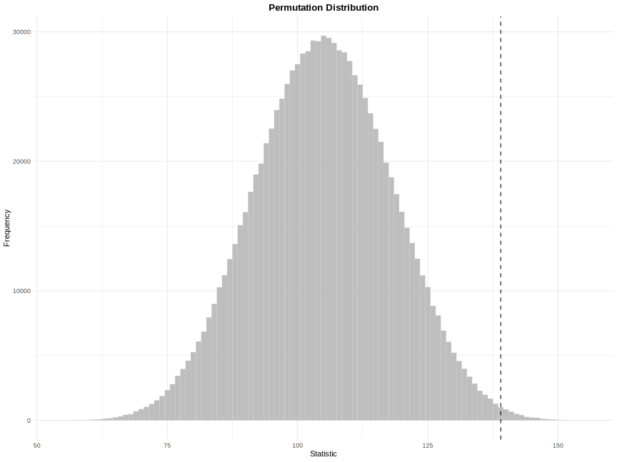

```{r, setup, include = FALSE}
knitr::opts_chunk$set(
    collapse = TRUE, comment = "#>",
    fig.path = "man/figures/README",
    fig.align = "center", out.width = "100%",
    asciicast_theme = if (Sys.getenv("IN_PKGDOWN") == "true") "pkgdown" else "readme"
)
asciicast::init_knitr_engine(
    echo = TRUE, echo_input = FALSE,
    startup = quote(library(LearnNonparam))
)
options(
    asciicast_at = "all",
    asciicast_cursor = FALSE,
    asciicast_knitr_svg = TRUE,
    asciicast_padding_y = 0,
    asciicast_start_wait = 0,
    asciicast_end_wait = 1,
    asciicast_timeout = Inf
)
```

# LearnNonparam 

[](https://cran.r-project.org/web/licenses/GPL-2)
[](https://cran.r-project.org/package=LearnNonparam)
[](https://cran.r-project.org/package=LearnNonparam)
[](https://r-pkg.org/pkg/LearnNonparam)
[](https://r-pkg.org/pkg/LearnNonparam)

## Overview

This R package implements several non-parametric tests in chapters 1-5 of [@higgins2004](#references), including tests for one sample, two samples, k samples, paired comparisons, blocked designs, trends and association. Built with [Rcpp](https://CRAN.R-project.org/package=Rcpp) for efficiency and [R6](https://CRAN.R-project.org/package=R6) for flexible, object-oriented design, it provides a unified framework for performing or creating custom permutation tests.

## Installation

Install the stable version from [CRAN](https://CRAN.R-project.org/package=LearnNonparam):

```{r, install_cran, eval = FALSE}
install.packages("LearnNonparam")
```

Install the development version from [Github](https://github.com/qddyy/LearnNonparam):

```{r, install_github, eval = FALSE}
# install.packages("remotes")
remotes::install_github("qddyy/LearnNonparam")
```

## Usage

```{r, library}
library(LearnNonparam)
```

- Construct a test object
    - from some R6 class directly
    ```{r, create_R6, eval = FALSE}
    t <- Wilcoxon$new(n_permu = 1e6)
    ```

    - using the `pmt` (**p**er**m**utation **t**est) wrapper
    ```{r, create_pmt, eval = FALSE}
    # recommended for a unified API
    t <- pmt("twosample.wilcoxon", n_permu = 1e6)
    ```

    ```{asciicast, create, include = FALSE}
    t <- pmt("twosample.wilcoxon", n_permu = 1e6)
    ```

- Provide it with samples

    ```{asciicast, test}
    set.seed(-1)

    t$test(rnorm(10, 1), rnorm(10, 0))
    ```

- Check the results
    ```{asciicast, statistic}
    t$statistic
    ```

    ```{asciicast, p_value}
    t$p_value
    ```

    ```{asciicast, print}
    options(digits = 3)

    t$print()
    ```

    ```{asciicast, plot}
    ggplot2::theme_set(ggplot2::theme_minimal())

    t$plot(style = "ggplot2", binwidth = 1)
    ```

    ```{asciicast, save_plot, include = FALSE}
    ggplot2::ggsave(
        "./man/figures/README/histogram.svg",
        width = 12, height = 9, device = "svg"
    )
    ```

    ```{r, include_plot, echo = FALSE}
    
    ```

- Modify some settings and observe the change
    ```{asciicast, modify}
    t$type <- "asymp"
    t$p_value
    ```

<details open>
<summary>See <code>pmts()</code> for tests implemented in this package.</summary>
<p>
```{r, pmts}
pmts()
```
</p>
</details>

## Extending

`define_pmt` allows users to define new permutation tests. Take the two-sample Wilcoxon test as an example:

```{asciicast, define_r}
t_custom <- define_pmt(
    # this is a two-sample permutation test
    inherit = "twosample",
    statistic = function(x, y) {
        # (optional) pre-calculate certain constants that remain invariant during permutation
        m <- length(x)
        n <- length(y)
        # return a closure to calculate the test statistic
        function(x, y) sum(x) / m - sum(y) / n
    },
    # reject the null hypothesis when the test statistic is too large or too small
    rejection = "lr", n_permu = 1e5
)
```

Also, the statistic can be written in C++. Leveraging Rcpp sugars and C++14 features, only minor modifications are needed to make it compatible with C++ syntax.

```{asciicast, define_cpp}
t_cpp <- define_pmt(
    inherit = "twosample", rejection = "lr", n_permu = 1e5,
    statistic = "[](const auto& x, const auto& y) {
        auto m = x.length();
        auto n = y.length();
        return [=](const auto& x, const auto& y) {
            return sum(x) / m - sum(y) / n;
        };
    }"
)
```

It's easy to check that `t_custom` and `t_cpp` are equivalent:

```{asciicast, prepare_data}
x <- rnorm(10, mean = 0)
y <- rnorm(10, mean = 5)
```

```{asciicast, t_custom_res}
set.seed(0)
t_custom$test(x, y)$print()
```

```{asciicast, t_cpp_res}
set.seed(0)
t_cpp$test(x, y)$print()
```

## Performance

[coin](https://CRAN.R-project.org/package=coin) is a commonly used R package for performing permutation tests. Below is a benchmark:

```{asciicast, benchmark}
library(coin)

data <- c(x, y)
group <- factor(c(rep("x", length(x)), rep("y", length(y))))

options(LearnNonparam.pmt_progress = FALSE)
benchmark <- microbenchmark::microbenchmark(
    R = t_custom$test(x, y),
    Rcpp = t_cpp$test(x, y),
    coin = wilcox_test(data ~ group, distribution = approximate(nresample = 1e5, parallel = "no"))
)
```

```{asciicast, benchmark_res}
benchmark
```

It can be seen that C++ brings significantly better performance than pure R, even surpassing the `coin` package (under sequential execution). However, all tests in this package are currently written in R with no plans for migration to C++ in the future. This is because the primary goal of this package is not to maximize performance but to offer a flexible framework for permutation tests.

## References