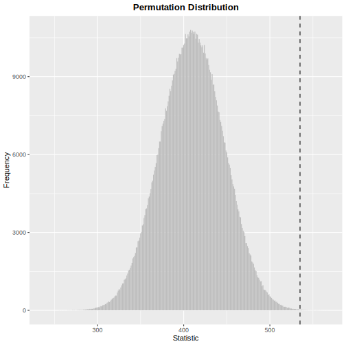

```{r, setup, include = FALSE}
knitr::opts_chunk$set(
    collapse = TRUE, comment = "#>",
    fig.path = "man/figures/README",
    asciicast_theme = if (Sys.getenv("IN_PKGDOWN") == "true") "pkgdown" else "readme"
)
asciicast::init_knitr_engine(
    echo = TRUE, echo_input = FALSE,
    startup = quote(library(LearnNonparam))
)
options(
    asciicast_at = "all",
    asciicast_cursor = FALSE,
    asciicast_knitr_svg = TRUE,
    asciicast_padding_y = 0,
    asciicast_start_wait = 0,
    asciicast_end_wait = 1
)
```

# LearnNonparam 


## Overview

This package implements some of the non-parametric tests in chapters 1-5 of [@Higgins2003](#references).

It depends on [R6](https://CRAN.R-project.org/package=R6) for object oriented design and [Rcpp](https://CRAN.R-project.org/package=Rcpp) for integration of R and C++.

A few examples in the book can be found [here](https://qddyy.github.io/LearnNonparam/articles/examples).

## Installation

```{r, install, eval = FALSE}
# install.packages("pak")
pak::pkg_install("qddyy/LearnNonparam")
```

## Basic Usage

```{r, library, eval = FALSE}
library(LearnNonparam)
options(LearnNonparam.pmt_progress = TRUE)
```

- Construct a test object
    - from some R6 class directly
    ```{r, create_R6, eval = FALSE}
    t <- Wilcoxon$new(n_permu = 1e6)
    ```

    - using the `pmt` (**p**er**m**utation **t**est) function (*recommended*)
    ```{r, create_pmt, eval = FALSE}
    t <- pmt("twosample.wilcoxon", n_permu = 1e6)
    ```

    ```{asciicast, create, include = FALSE}
    t <- pmt("twosample.wilcoxon", n_permu = 1e6)
    ```

- Provide it with samples
    ```{asciicast, test}
    t$test(rnorm(20, 1), rnorm(20, 0))
    ```

- Check the results
    ```{asciicast, statistic}
    t$statistic
    ```

    ```{asciicast, p_value}
    t$p_value
    ```

    ```{asciicast, print}
    t$print()
    ```

    ```{asciicast, plot}
    t$plot(style = "ggplot2", binwidth = 1)
    ```

    ```{asciicast, save_plot, include = FALSE}
    ggplot2::ggsave("./man/figures/README/ggplot.svg", device = "svg")
    ```

    ```{r, include_plot, echo = FALSE, out.width = "100%"}
    
    ```

- Modify some active bindings and see how the results change
    ```{asciicast, modify}
    t$type <- "asymp"
    t$p_value
    ```

<details><summary>
See <code>pmts()</code> for tests implemented in this package.</summary>
```{r, echo = FALSE}
LearnNonparam::pmts()
```
</details>

## Experimental Features

The `define_pmt` function allows users to define new permutation tests. Take Cramér-von Mises test as an example:

```{asciicast, define}
t <- define_pmt(
    # this is a two-sample permutation test
    inherit = "twosample",
    statistic = function(x, y) {
        # pre-calculate certain constants that remain invariant during permutation
        n_x <- length(x)
        n_y <- length(y)
        F_x <- seq_len(n_x) / n_x
        G_y <- seq_len(n_y) / n_y
        # return another function to calculate the test statistic
        function(x, y) {
            x <- sort(x)
            y <- sort(y)
            F <- approxfun(x, F_x, "constant", 0, 1, ties = "ordered")
            G <- approxfun(y, G_y, "constant", 0, 1, ties = "ordered")
            sum(c(F_x - G(x), G_y - F(y))^2)
        }
    },
    # reject the null hypothesis when the test statistic is large
    rejection = "r",
    scoring = "none", n_permu = 1e4,
    name = "Cramér-von Mises Test",
    alternative = "samples are from different distributions"
)

t$test(rnorm(20, 1), rnorm(20, 0))$print()
```

## References