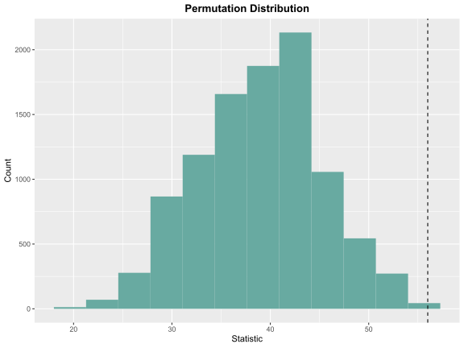

<!-- README.md is generated from README.Rmd. Please edit that file -->

# LearnNonparam

<!-- badges: start -->

[](https://github.com/qddyy/LearnNonparam/actions/workflows/R-CMD-check.yaml)
<!-- badges: end -->

This package implements the tests in chapters 1-5 of [Higgins
(2003)](#references).

It uses [R6](https://cran.r-project.org/package=R6) for clean OO-design
and [arrangements](https://cran.r-project.org/package=arrangements) for
fast generation of permutations.

## Installation

You can install the development version of LearnNonparam from
[GitHub](https://github.com/) with:

``` r
# install.packages("devtools")
devtools::install_github("qddyy/LearnNonparam", dependencies = TRUE)
```

## Usage

``` r
library(LearnNonparam)
```

- Create a test (for example, a `Wilcoxon` object)

  ``` r
  t <- Wilcoxon$new(type = "permu", n_permu = 10000)
  ```

  or you can use `pmt` (**p**er**m**utation **t**est) function
  (*Recommended*):

  ``` r
  t <- pmt("twosample.wilcoxon", type = "permu", n_permu = 10000)
  ```

- feed it the data (a data.frame, a list, or some numeric vectors)

  ``` r
  t$feed(Table2.6.2)
  ```

- check the results

  ``` r
  print(t$statistic)
  #> [1] 35
  print(t$p_value)
  #> [1] 0.0018

  print(t$estimate)
  #> [1] 30.045
  print(t$ci)
  #> [1] 11.57 50.76

  t$plot_hist(bins = 12)
  ```

  

- modify some attributes and see how the results change

  ``` r
  t$type <- "approx"

  print(t$p_value)
  #> [1] 0.008239019
  ```

There’s also support for chained calls, which means that you can do
things like

``` r
pmt("twosample.wilcoxon", type = "permu", n_permu = 10000)$feed(Table2.6.2)$plot_hist(bins = 12)$p_value
```

## Help

Just use `?...` syntax.

If you want to know all available methods and attributes, it’s a good
idea to explore `?PermuTest` (all tests’ **base class**) first.

If you want to know all available tests, see `pmts()`.

``` r
pmts()
#>                   key                                                  test
#> 1  onesample.quantile                                         Quantile Test
#> 2      onesample.ecdf            Empirical Cumulative Distribution Function
#> 3      twosample.mean                    Two Sample Permutation Test (mean)
#> 4  twosample.wilcoxon                              Two Sample Wilcoxon Test
#> 5  twosample.scoresum                                        Score Sum Test
#> 6    twosample.ansari                                   Ansari-Bradley Test
#> 7    twosample.siegel                                     Siegel-Tukey Test
#> 8       twosample.rmd                              Ratio Mean Deviance Test
#> 9        twosample.ks                    Two Sample Kolmogorov-Smirnov Test
#> 10      ksample.anova                                                 ANOVA
#> 11         ksample.kw                                   Kruskal-Wallis Test
#> 12         ksample.jt                              Jonckheere-Terpstra Test
#> 13        multicomp.t                          Multiple Comparison (t test)
#> 14    multicomp.tukey                                             Tukey HSD
#> 15  paired.comparison                                     Paired Comparison
#> 16        paired.sign                                             Sign Test
#> 17 paired.signedscore                                     Signed Score Test
#> 18         rcbd.anova            ANOVA for Randomized Complete Block Design
#> 19      rcbd.friedman                                         Friedman Test
#> 20          rcbd.page                                             Page Test
#> 21   association.corr Two Sample Permutation Test (correlation coefficient)
#> 22          table.chi       Contingency Table Permutation Test (chi-square)
```

## References

<div id="refs" class="references csl-bib-body hanging-indent">

<div id="ref-Higgins2003" class="csl-entry">

Higgins, James J. 2003. *An Introduction to Modern Nonparametric
Statistics*. Florence, KY: Brooks/Cole.

</div>

</div>
