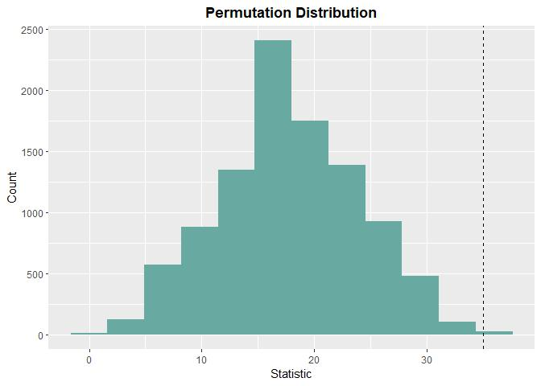

<!-- README.md is generated from README.Rmd. Please edit that file -->

# LearnNonparam

<!-- badges: start -->

[](https://github.com/qddyy/LearnNonparam/actions/workflows/R-CMD-check.yaml)
<!-- badges: end -->

This package implements the tests in chapters 1-5 of Higgins (2003).

It uses [R6](https://cran.r-project.org/package=R6) for clean OO-design
and object property-changes, as well as
[arrangements](https://cran.r-project.org/package=arrangements) for fast
generation of permutations.

## Installation

You can install the development version of LearnNonparam from
[GitHub](https://github.com/) with:

``` r
# install.packages("devtools")
devtools::install_github("qddyy/LearnNonparam", dependencies = TRUE)
```

## Usage

``` r
library(LearnNonparam)
```

- Create a test (for example, a `Wilcoxon` object)

  ``` r
  t <- Wilcoxon$new(type = "permu", n_permu = 10000)
  ```

  or you can use `pmt` (**p**er**m**utation **t**est) function
  (*Recommended*):

  ``` r
  t <- pmt("twosample.wilcoxon", type = "permu", n_permu = 10000)
  ```

- feed it the data (`data.frame` \| `list` \| `vector`s)

  ``` r
  t$feed(Table2.6.2)
  ```

- check the results

  ``` r
  print(t$statistic)
  #> [1] 35
  print(t$p_value)
  #> [1] 0.0022

  print(t$estimate)
  #> [1] 30.045
  print(t$ci)
  #> [1] 11.57 50.76

  t$plot_hist(bins = 12)
  ```

  

- modify some attributes and see how the results change

  ``` r
  t$type <- "approx"

  print(t$p_value)
  #> [1] 0.008239019
  ```

There’s also support for chained calls, which means that you can do
things like

``` r
pmt("twosample.wilcoxon", type = "permu", n_permu = 10000)$feed(Table2.6.2)$plot_hist(bins = 12)$p_value
```

## Help

Just use `?...` syntax.

If you want to know all available methods and attributes, it’s a good
idea to explore `?PermuTest` (all tests’ **base class**) first.

If you want to know all available tests, see `pmts()`.

``` r
pmts()
```

<div class="kable-table">

| key                | test                                                  |
|:-------------------|:------------------------------------------------------|
| onesample.quantile | Quantile Test                                         |
| onesample.ecdf     | Empirical Cumulative Distribution Function            |
| twosample.mean     | Two Sample Permutation Test (mean)                    |
| twosample.wilcoxon | Two Sample Wilcoxon Test                              |
| twosample.scoresum | Score Sum Test                                        |
| twosample.ansari   | Ansari-Bradley Test                                   |
| twosample.siegel   | Siegel-Tukey Test                                     |
| twosample.rmd      | Ratio Mean Deviance Test                              |
| twosample.ks       | Two Sample Kolmogorov-Smirnov Test                    |
| ksample.anova      | ANOVA                                                 |
| ksample.kw         | Kruskal-Wallis Test                                   |
| ksample.jt         | Jonckheere-Terpstra Test                              |
| multicomp.t        | Multiple Comparison (t test)                          |
| multicomp.tukey    | Tukey HSD                                             |
| paired.comparison  | Paired Comparison                                     |
| paired.sign        | Sign Test                                             |
| paired.signedscore | Signed Score Test                                     |
| rcbd.anova         | ANOVA for Randomized Complete Block Design            |
| rcbd.friedman      | Friedman Test                                         |
| rcbd.page          | Page Test                                             |
| association.corr   | Two Sample Permutation Test (correlation coefficient) |
| table.chi          | Contingency Table Permutation Test (chi-square)       |

</div>

## References

<div id="refs" class="references csl-bib-body hanging-indent">

<div id="ref-Higgins2003" class="csl-entry">

Higgins, J. J. 2003. *An Introduction to Modern Nonparametric
Statistics*. Florence, KY: Brooks/Cole.

</div>

</div>
