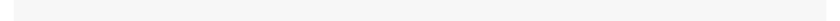

# LearnNonparam 

[](https://cran.r-project.org/web/licenses/GPL-2)
[](https://cran.r-project.org/package=LearnNonparam)
[](https://cran.r-project.org/package=LearnNonparam)
[](https://r-pkg.org/pkg/LearnNonparam)
[](https://r-pkg.org/pkg/LearnNonparam)

## Overview

This R package implements several non-parametric tests in chapters 1-5
of [Higgins (2004)](#references), including tests for one sample, two
samples, k samples, paired comparisons, blocked designs, trends and
association. Built with [Rcpp](https://CRAN.R-project.org/package=Rcpp)
for efficiency and [R6](https://CRAN.R-project.org/package=R6) for
flexible, object-oriented design, it provides a unified framework for
performing or creating custom permutation tests.

## Installation

Install the stable version from
[CRAN](https://CRAN.R-project.org/package=LearnNonparam):

``` r
install.packages("LearnNonparam")
```

Install the development version from
[Github](https://github.com/qddyy/LearnNonparam):

``` r
# install.packages("remotes")
remotes::install_github("qddyy/LearnNonparam")
```

## Usage

``` r
library(LearnNonparam)
```

- Construct a test object

  - from some R6 class directly

  ``` r
  t <- Wilcoxon$new(n_permu = 1e6)
  ```

  - using the `pmt` (**p**er**m**utation **t**est) wrapper

  ``` r
  # recommended for a unified API
  t <- pmt("twosample.wilcoxon", n_permu = 1e6)
  ```

- Provide it with samples

  ``` r
  set.seed(-1)

  t$test(rnorm(10, 1), rnorm(10, 0))
  ```

  <picture>
  <source media="(prefers-color-scheme: dark)" srcset="man/figures/README/test-dark.svg">
  
  </picture>

- Check the results

  ``` r
  t$statistic
  ```

  <picture>
  <source media="(prefers-color-scheme: dark)" srcset="man/figures/README/statistic-dark.svg">
  
  </picture>

  ``` r
  t$p_value
  ```

  <picture>
  <source media="(prefers-color-scheme: dark)" srcset="man/figures/README/p_value-dark.svg">
  
  </picture>

  ``` r
  options(digits = 3)

  t$print()
  ```

  <picture>
  <source media="(prefers-color-scheme: dark)" srcset="man/figures/README/print-dark.svg">
  
  </picture>

  ``` r
  ggplot2::theme_set(ggplot2::theme_minimal())

  t$plot(style = "ggplot2", binwidth = 1)
  ```

  <picture>
  <source media="(prefers-color-scheme: dark)" srcset="man/figures/README/plot-dark.svg">
  
  </picture>

  

- Modify some settings and observe the change

  ``` r
  t$type <- "asymp"
  t$p_value
  ```

  <picture>
  <source media="(prefers-color-scheme: dark)" srcset="man/figures/README/modify-dark.svg">
  
  </picture>

<details>

<summary>

See <code>pmts()</code> for tests implemented in this package.
</summary>

<div class="kable-table">

| key | class | test |
|:---|:---|:---|
| onesample.quantile | Quantile | Quantile Test |
| onesample.cdf | CDF | Inference on Cumulative Distribution Function |
| twosample.difference | Difference | Two-Sample Test Based on Mean or Median |
| twosample.wilcoxon | Wilcoxon | Two-Sample Wilcoxon Test |
| twosample.scoresum | ScoreSum | Two-Sample Test Based on Sum of Scores |
| twosample.ansari | AnsariBradley | Ansari-Bradley Test |
| twosample.siegel | SiegelTukey | Siegel-Tukey Test |
| twosample.rmd | RatioMeanDeviance | Ratio Mean Deviance Test |
| twosample.ks | KolmogorovSmirnov | Two-Sample Kolmogorov-Smirnov Test |
| ksample.oneway | OneWay | One-Way Test for Equal Means |
| ksample.kw | KruskalWallis | Kruskal-Wallis Test |
| ksample.jt | JonckheereTerpstra | Jonckheere-Terpstra Test |
| multcomp.studentized | Studentized | Multiple Comparison Based on Studentized Statistic |
| paired.sign | Sign | Two-Sample Sign Test |
| paired.difference | PairedDifference | Paired Comparison Based on Differences |
| rcbd.oneway | RCBDOneWay | One-Way Test for Equal Means in RCBD |
| rcbd.friedman | Friedman | Friedman Test |
| rcbd.page | Page | Page Test |
| association.corr | Correlation | Test for Association Between Paired Samples |
| table.chisq | ChiSquare | Chi-Square Test on Contingency Table |

</div>

</details>

## Extending

`define_pmt` allows users to define new permutation tests. Take the
two-sample Wilcoxon test as an example:

``` r
t_custom <- define_pmt(
    # this is a two-sample permutation test
    inherit = "twosample",
    statistic = function(x, y) {
        # (optional) pre-calculate certain constants that remain invariant during permutation
        m <- length(x)
        n <- length(y)
        # return a closure to calculate the test statistic
        function(x, y) sum(x) / m - sum(y) / n
    },
    # reject the null hypothesis when the test statistic is too large or too small
    rejection = "lr", n_permu = 1e5
)
```

<picture>
<source media="(prefers-color-scheme: dark)" srcset="man/figures/README/define_r-dark.svg">

</picture>

Also, the statistic can be written in C++. Leveraging Rcpp sugars and
C++14 features, only minor modifications are needed to make it
compatible with C++ syntax.

``` r
t_cpp <- define_pmt(
    inherit = "twosample", rejection = "lr", n_permu = 1e5,
    statistic = "[](const auto& x, const auto& y) {
        auto m = x.length();
        auto n = y.length();
        return [=](const auto& x, const auto& y) {
            return sum(x) / m - sum(y) / n;
        };
    }"
)
```

<picture>
<source media="(prefers-color-scheme: dark)" srcset="man/figures/README/define_cpp-dark.svg">

</picture>

It’s easy to check that `t_custom` and `t_cpp` are equivalent:

``` r
x <- rnorm(10, mean = 0)
y <- rnorm(10, mean = 5)
```

<picture>
<source media="(prefers-color-scheme: dark)" srcset="man/figures/README/prepare_data-dark.svg">

</picture>

``` r
set.seed(0)
t_custom$test(x, y)$print()
```

<picture>
<source media="(prefers-color-scheme: dark)" srcset="man/figures/README/t_custom_res-dark.svg">

</picture>

``` r
set.seed(0)
t_cpp$test(x, y)$print()
```

<picture>
<source media="(prefers-color-scheme: dark)" srcset="man/figures/README/t_cpp_res-dark.svg">

</picture>

## Performance

[coin](https://CRAN.R-project.org/package=coin) is a commonly used R
package for performing permutation tests. Below is a benchmark:

``` r
library(coin)

data <- c(x, y)
group <- factor(c(rep("x", length(x)), rep("y", length(y))))

options(LearnNonparam.pmt_progress = FALSE)
benchmark <- microbenchmark::microbenchmark(
    R = t_custom$test(x, y),
    Rcpp = t_cpp$test(x, y),
    coin = wilcox_test(data ~ group, distribution = approximate(nresample = 1e5, parallel = "no"))
)
```

<picture>
<source media="(prefers-color-scheme: dark)" srcset="man/figures/README/benchmark-dark.svg">

</picture>

``` r
benchmark
```

<picture>
<source media="(prefers-color-scheme: dark)" srcset="man/figures/README/benchmark_res-dark.svg">

</picture>

It can be seen that C++ brings significantly better performance than
pure R, even surpassing the `coin` package (under sequential execution).
However, all tests in this package are currently written in R with no
plans for migration to C++ in the future. This is because the primary
goal of this package is not to maximize performance but to offer a
flexible framework for permutation tests.

## References

<div id="refs" class="references csl-bib-body hanging-indent"
entry-spacing="0">

<div id="ref-higgins2004" class="csl-entry">

Higgins, J. J. 2004. *An Introduction to Modern Nonparametric
Statistics*. Duxbury Advanced Series. Brooks/Cole.

</div>

</div>
