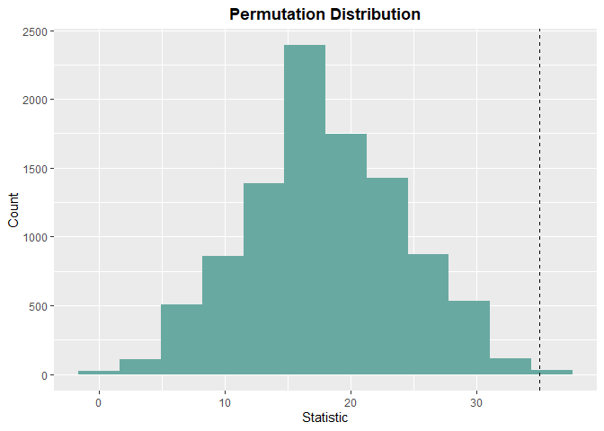

<!-- README.md is generated from README.Rmd. Please edit that file -->

# LearnNonparam

<!-- badges: start -->

[](https://app.codecov.io/gh/qddyy/LearnNonparam?branch=master)
[](https://github.com/qddyy/LearnNonparam/actions/workflows/R-CMD-check.yaml)
<!-- badges: end -->

The goal of LearnNonparam is to conduct non-parametric tests (mostly
based on permutations).

## Installation

You can install the development version of LearnNonparam from
[GitHub](https://github.com/) with:

``` r
# install.packages("devtools")
devtools::install_github("qddyy/LearnNonparam", dependencies = TRUE, upgrade = "never")
```

## Example

``` r
library(LearnNonparam)
```

- Create a test object

  ``` r
  t <- Wilcoxon$new(type = "permu", n_permu = 10000)
  ```

  or you can use `pmt` (**p**er**m**utation **t**est) function
  (**Recommended**):

  ``` r
  # See ?pmt
  t <- pmt("twosample.wilcoxon", type = "permu", n_permu = 10000)
  ```

- feed it the data

  ``` r
  t$feed(Table2.6.2)
  ```

- check the results

  ``` r
  print(t$statistic)
  #> [1] 35
  print(t$p_value)
  #> [1] 0.0027

  print(t$estimate)
  #> [1] 30.045
  print(t$ci)
  #> [1] 11.57 50.76

  t$plot_hist(bins = 12)
  ```

  

- modify some attributes and see how the results change

  ``` r
  t$type <- "approx"

  print(t$p_value)
  #> [1] 0.008239019
  ```

## Help

Just use `?...` syntax.

If you want to know all available methods and attributes, it’s a good
idea to explore `?PermuTest` (all tests’ **base class**) first.

If you want to know all available tests, see `pmts`.

``` r
pmts
#>                   key                                                  test
#> 1           table.chi       Contingency Table Permutation Test (chi-square)
#> 2    association.corr Two Sample Permutation Test (correlation coefficient)
#> 3           rcbd.page                                             Page Test
#> 4       rcbd.friedman                                         Friedman Test
#> 5          rcbd.anova            ANOVA for Randomized Complete Block Design
#> 6  paired.signedscore                                     Signed Score Test
#> 7         paired.sign                                             Sign Test
#> 8   paired.comparison                                     Paired Comparison
#> 9     multicomp.tukey                                             Tukey HSD
#> 10        multicomp.t                          Multiple Comparison (t test)
#> 11         ksample.jt                              Jonckheere-Terpstra Test
#> 12         ksample.kw                                   Kruskal-Wallis Test
#> 13      ksample.anova                                                 ANOVA
#> 14       twosample.ks                    Two Sample Kolmogorov-Smirnov Test
#> 15      twosample.rmd                              Ratio Mean Deviance Test
#> 16       twosample.ab                                   Ansari-Bradley Test
#> 17       twosample.st                                     Siegel-Tukey Test
#> 18 twosample.scoresum                                        Score Sum Test
#> 19 twosample.wilcoxon                              Two Sample Wilcoxon Test
#> 20     twosample.mean                    Two Sample Permutation Test (mean)
#> 21     onesample.ecdf            Empirical Cumulative Distribution Function
#> 22 onesample.quantile                                         Quantile Test
```
