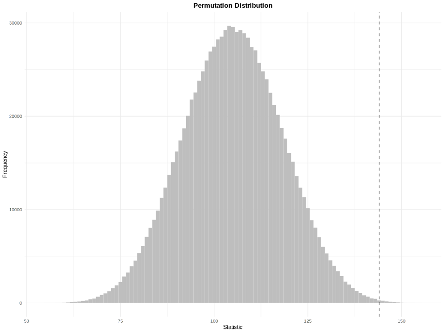

# LearnNonparam 

[](https://cran.r-project.org/web/licenses/GPL-2)
[](https://cran.r-project.org/package=LearnNonparam)
[](https://cran.r-project.org/package=LearnNonparam)
[](https://r-pkg.org/pkg/LearnNonparam)
[](https://r-pkg.org/pkg/LearnNonparam)

## Overview

This R package implements several non-parametric tests in chapters 1-5
of [Higgins (2004)](#references), including tests for one sample, two
samples, k samples, paired comparisons, blocked designs, trends and
association. Built with [Rcpp](https://CRAN.R-project.org/package=Rcpp)
for efficiency and [R6](https://CRAN.R-project.org/package=R6) for
flexible, object-oriented design, it provides a unified framework for
performing or creating custom permutation tests.

## Installation

Install the stable version from
[CRAN](https://CRAN.R-project.org/package=LearnNonparam):

``` r
install.packages("LearnNonparam")
```

Install the development version from
[Github](https://github.com/qddyy/LearnNonparam):

``` r
# install.packages("remotes")
remotes::install_github("qddyy/LearnNonparam")
```

## Usage

``` r
library(LearnNonparam)
options(LearnNonparam.pmt_progress = TRUE)
```

- Construct a test object

  - from some R6 class directly

  ``` r
  t <- Wilcoxon$new(n_permu = 1e6)
  ```

  - using the `pmt` (**p**er**m**utation **t**est) wrapper

  ``` r
  # recommended for a unified API
  t <- pmt("twosample.wilcoxon", n_permu = 1e6)
  ```

- Provide it with samples

  ``` r
  set.seed(-1)

  t$test(rnorm(10, 1), rnorm(10, 0))
  ```

  <picture>
  <source media="(prefers-color-scheme: dark)" srcset="man/figures/README/test-dark.svg">
  
  </picture>

- Check the results

  ``` r
  t$statistic
  ```

  <picture>
  <source media="(prefers-color-scheme: dark)" srcset="man/figures/README/statistic-dark.svg">
  
  </picture>

  ``` r
  t$p_value
  ```

  <picture>
  <source media="(prefers-color-scheme: dark)" srcset="man/figures/README/p_value-dark.svg">
  
  </picture>

  ``` r
  options(digits = 3)

  t$print()
  ```

  <picture>
  <source media="(prefers-color-scheme: dark)" srcset="man/figures/README/print-dark.svg">
  
  </picture>

  ``` r
  ggplot2::theme_set(ggplot2::theme_minimal())

  t$plot(style = "ggplot2", binwidth = 1)
  ```

  <picture>
  <source media="(prefers-color-scheme: dark)" srcset="man/figures/README/plot-dark.svg">
  
  </picture>

  

- Modify some settings and observe the change

  ``` r
  t$type <- "asymp"
  t$p_value
  ```

  <picture>
  <source media="(prefers-color-scheme: dark)" srcset="man/figures/README/modify-dark.svg">
  
  </picture>

<details>
<summary>
See <code>pmts()</code> for tests implemented in this package.
</summary>

<div class="kable-table">

| key                  | class              | test                                               |
|:---------------------|:-------------------|:---------------------------------------------------|
| onesample.quantile   | Quantile           | Quantile Test                                      |
| onesample.cdf        | CDF                | Inference on Cumulative Distribution Function      |
| twosample.difference | Difference         | Two-Sample Test Based on Mean or Median            |
| twosample.wilcoxon   | Wilcoxon           | Two-Sample Wilcoxon Test                           |
| twosample.scoresum   | ScoreSum           | Two-Sample Test Based on Sum of Scores             |
| twosample.ansari     | AnsariBradley      | Ansari-Bradley Test                                |
| twosample.siegel     | SiegelTukey        | Siegel-Tukey Test                                  |
| twosample.rmd        | RatioMeanDeviance  | Ratio Mean Deviance Test                           |
| twosample.ks         | KolmogorovSmirnov  | Two-Sample Kolmogorov-Smirnov Test                 |
| ksample.oneway       | OneWay             | One-Way Test for Equal Means                       |
| ksample.kw           | KruskalWallis      | Kruskal-Wallis Test                                |
| ksample.jt           | JonckheereTerpstra | Jonckheere-Terpstra Test                           |
| multcomp.studentized | Studentized        | Multiple Comparison Based on Studentized Statistic |
| paired.sign          | Sign               | Two-Sample Sign Test                               |
| paired.difference    | PairedDifference   | Paired Comparison Based on Differences             |
| rcbd.oneway          | RCBDOneWay         | One-Way Test for Equal Means in RCBD               |
| rcbd.friedman        | Friedman           | Friedman Test                                      |
| rcbd.page            | Page               | Page Test                                          |
| association.corr     | Correlation        | Test for Association Between Paired Samples        |
| table.chisq          | ChiSquare          | Chi-Square Test on Contingency Table               |

</div>

</details>

`define_pmt` allows users to define new permutation tests. Take the
two-sample Cramér-Von Mises test as an example:

``` r
t <- define_pmt(
    # this is a two-sample permutation test
    inherit = "twosample",
    statistic = function(x, y) {
        # (optional) pre-calculate certain constants that remain invariant during permutation
        n_x <- length(x)
        n_y <- length(y)
        F_x <- seq_len(n_x) / n_x
        G_y <- seq_len(n_y) / n_y
        # return a closure to calculate the test statistic
        function(x, y) {
            x <- sort.int(x)
            y <- sort.int(y)
            F <- approxfun(x, F_x, "constant", 0, 1)
            G <- approxfun(y, G_y, "constant", 0, 1)
            sum(c(F_x - G(x), G_y - F(y))^2)
        }
    },
    # reject the null hypothesis when the test statistic is large
    rejection = "r",
    name = "Two-Sample Cramér-Von Mises Test",
    alternative = "samples are from different continuous distributions"
)

t$test(rnorm(10), runif(10))$print()
```

<picture>
<source media="(prefers-color-scheme: dark)" srcset="man/figures/README/define-dark.svg">

</picture>

## References

<div id="refs" class="references csl-bib-body hanging-indent">

<div id="ref-higgins2004" class="csl-entry">

Higgins, J. J. 2004. *An Introduction to Modern Nonparametric
Statistics*. Duxbury Advanced Series. Brooks/Cole.

</div>

</div>
