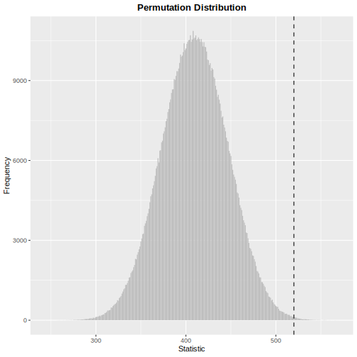

# LearnNonparam 

[](https://cran.r-project.org/web/licenses/GPL-2)
[](https://github.com/qddyy/LearnNonparam)
[](https://github.com/qddyy/LearnNonparam)
[](https://www.codefactor.io/repository/github/qddyy/LearnNonparam)
[](https://github.com/qddyy/LearnNonparam/actions/workflows/R-CMD-check.yaml)

## Overview

This package implements some of the non-parametric tests in chapters 1-5
of [Higgins (2003)](#references).

It depends on [R6](https://CRAN.R-project.org/package=R6) for object
oriented design and [Rcpp](https://CRAN.R-project.org/package=Rcpp) for
integration of R and C++.

A few examples in the book can be found
[here](https://qddyy.github.io/LearnNonparam/articles/examples).

## Installation

``` r
# install.packages("pak")
pak::pkg_install("qddyy/LearnNonparam")
```

## Basic Usage

``` r
library(LearnNonparam)
options(LearnNonparam.pmt_progress = TRUE)
```

- Construct a test object

  - from some R6 class directly

  ``` r
  t <- Wilcoxon$new(n_permu = 1e6)
  ```

  - using the `pmt` (**p**er**m**utation **t**est) function
    (*recommended*)

  ``` r
  t <- pmt("twosample.wilcoxon", n_permu = 1e6)
  ```

- Provide it with samples

  ``` r
  t$test(rnorm(20, 1), rnorm(20, 0))
  ```

  <picture>
  <source media="(prefers-color-scheme: dark)" srcset="man/figures/README/test-dark.svg">
   </picture>

- Check the results

  ``` r
  t$statistic
  ```

  <picture>
  <source media="(prefers-color-scheme: dark)" srcset="man/figures/README/statistic-dark.svg">
   </picture>

  ``` r
  t$p_value
  ```

  <picture>
  <source media="(prefers-color-scheme: dark)" srcset="man/figures/README/p_value-dark.svg">
   </picture>

  ``` r
  t$print()
  ```

  <picture>
  <source media="(prefers-color-scheme: dark)" srcset="man/figures/README/print-dark.svg">
   </picture>

  ``` r
  t$plot(style = "ggplot2", binwidth = 1)
  ```

  <picture>
  <source media="(prefers-color-scheme: dark)" srcset="man/figures/README/plot-dark.svg">
   </picture>

  

- Modify some active bindings and see how the results change

  ``` r
  t$type <- "asymp"
  t$p_value
  ```

  <picture>
  <source media="(prefers-color-scheme: dark)" srcset="man/figures/README/modify-dark.svg">
   </picture>

See `pmts()` for tests implemented in this package:

<div class="kable-table">

| key                   | class              | test                                               |
|:----------------------|:-------------------|:---------------------------------------------------|
| onesample.quantile    | Quantile           | Quantile Test                                      |
| onesample.cdf         | CDF                | Inference on Cumulative Distribution Function      |
| twosample.difference  | Difference         | Two-Sample Test Based on Mean or Median            |
| twosample.wilcoxon    | Wilcoxon           | Two-Sample Wilcoxon Test                           |
| twosample.scoresum    | ScoreSum           | Two-Sample Test Based on Sum of Scores             |
| twosample.ansari      | AnsariBradley      | Ansari-Bradley Test                                |
| twosample.siegel      | SiegelTukey        | Siegel-Tukey Test                                  |
| twosample.rmd         | RatioMeanDeviance  | Ratio Mean Deviance Test                           |
| twosample.ks          | KolmogorovSmirnov  | Two-Sample Kolmogorov-Smirnov Test                 |
| ksample.f             | KSampleF           | K-Sample Test Based on F Statistic                 |
| ksample.kw            | KruskalWallis      | Kruskal-Wallis Test                                |
| ksample.jt            | JonckheereTerpstra | Jonckheere-Terpstra Test                           |
| multicomp.studentized | Studentized        | Multiple Comparison Based on Studentized Statistic |
| paired.sign           | Sign               | Two-Sample Sign Test                               |
| paired.difference     | PairedDifference   | Paired Comparison Based on Differences             |
| rcbd.f                | RCBDF              | Test for RCBD Based on F Statistic                 |
| rcbd.friedman         | Friedman           | Friedman Test                                      |
| rcbd.page             | Page               | Page Test                                          |
| association.corr      | Correlation        | Test for Association Between Paired Samples        |
| table.chisq           | ChiSquare          | Chi-Square Test on Contingency Table               |

</div>

## Experimental Features

The `define_pmt` function allows users to define new permutation tests.
Take Cramér-von Mises test as an example:

``` r
t <- define_pmt(
    # this is a two-sample permutation test
    inherit = "twosample",
    # provide a function to calculate the test statistic
    statistic = function(...) {
        function(x, y) {
            F_n <- ecdf(x)
            G_n <- ecdf(y)
            sum(c(F_n(x) - G_n(x), F_n(y) - G_n(y))^2)
        }
    },
    # reject the null hypothesis when the test statistic is large
    rejection = "r",
    scoring = "none", n_permu = 1e4,
    name = "Cramér-von Mises Test",
    alternative = "samples are from different distributions"
)

t$test(rnorm(20, 1), rnorm(20, 0))$print()
```

<picture>
<source media="(prefers-color-scheme: dark)" srcset="man/figures/README/define-dark.svg">
 </picture>

## References

<div id="refs" class="references csl-bib-body hanging-indent">

<div id="ref-Higgins2003" class="csl-entry">

Higgins, James J. 2003. *An Introduction to Modern Nonparametric
Statistics*. Florence, KY: Brooks/Cole.

</div>

</div>
