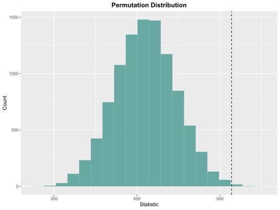

# LearnNonparam

[](https://github.com/qddyy/LearnNonparam/actions/workflows/R-CMD-check.yaml)

This package implements most of the tests in chapters 1-5 of [Higgins
(2003)](#references).

It uses [R6](https://cran.r-project.org/package=R6) for clean OO-design
and [arrangements](https://cran.r-project.org/package=arrangements) for
fast generation of permutations.

## Installation

You can install the development version of this package with:

``` r
# install.packages("remotes")
remotes::install_github("qddyy/LearnNonparam")
```

## Usage

``` r
library(LearnNonparam)
```

- Create a test (for example, a `Wilcoxon` object)

  ``` r
  t <- Wilcoxon$new(alternative = "greater", type = "permu", n_permu = 10000)
  ```

  or you can use `pmt` (**p**er**m**utation **t**est) function
  (*Recommended*):

  ``` r
  t <- pmt("twosample.wilcoxon", alternative = "greater", type = "permu", n_permu = 10000)
  ```

- feed it the data (a data frame, a list, or some numeric vectors)

  ``` r
  t$feed(rnorm(20, mean = 1), rnorm(20, mean = 0))
  ```

- check the results

  ``` r
  print(t$p_value)
  #> [1] 0.0019

  t$print()
  #> 
  #>       Two Sample Wilcoxon Test 
  #> 
  #> type: permu    method: default    
  #> statistic = 514, p-value = 0.0019, 
  #> alternative hypothesis: greater 
  #> estimate: 1.064333 
  #> 95 percent confidence interval: 0.3204069 1.9678062

  t$plot(bins = 20)
  ```

  

- modify some attributes and see how the results change

  ``` r
  t$type <- "approx"

  print(t$p_value)
  #> [1] 0.002557631
  ```

There is also support for chaining method calls, which means that you
can do things like

``` r
pmt("twosample.wilcoxon", type = "permu", n_permu = 10000)$feed(Table2.6.2)$print()$plot()
```

## Help

Just use `?...` syntax.

If you want to know available methods and attributes, you can start by
exploring `?PermuTest` (all tests’ **base class**).

If you want to know available tests, see `pmts(...)`.

``` r
pmts("twosample")
#>                 key             class                               test
#>      twosample.mean          MeanDiff      Two Sample Test Based on Mean
#>  twosample.wilcoxon          Wilcoxon           Two Sample Wilcoxon Test
#>  twosample.scoresum          ScoreSum                     Score Sum Test
#>    twosample.ansari     AnsariBradley                Ansari-Bradley Test
#>    twosample.siegel       SiegelTukey                  Siegel-Tukey Test
#>       twosample.rmd RatioMeanDeviance           Ratio Mean Deviance Test
#>        twosample.ks KolmogorovSmirnov Two Sample Kolmogorov-Smirnov Test
```

## References

<div id="refs" class="references csl-bib-body hanging-indent">

<div id="ref-Higgins2003" class="csl-entry">

Higgins, James J. 2003. *An Introduction to Modern Nonparametric
Statistics*. Florence, KY: Brooks/Cole.

</div>

</div>
